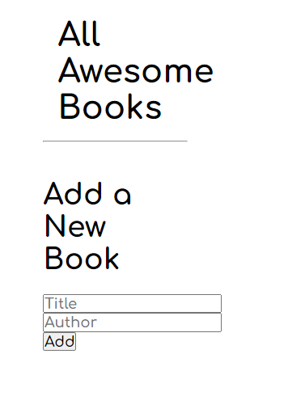

# Project Name

> Websita that allows users add/remove books from a list.

In this project, we have a basic website that allows users to add/remove books from a list. I did that by using JavaScript objects and arrays. And also I did dynamically modifying the DOM and adding basic events.

## Built With

- Index.html
- Style.css
- Main.js

## Live Demo

[Live Demo Link](https://oliverscz.github.io/awesome-books/)

## Authors

👤 **Author1**

- GitHub: [@oliverSCZ](https://github.com/oliverSCZ)
- Twitter: [@olivercoimbra](https://twitter.com/Olivercoimbra)
- LinkedIn: [olivercoimbra](https://www.linkedin.com/in/oliver-coimbra/)

## 🤝 Contributing

Contributions, issues, and feature requests are welcome!

Feel free to check the [issues page](../../issues/).

## Show your support

Give a ⭐️ if you like this project!

## 📝 License

This project is [MIT](./MIT.md) licensed.
